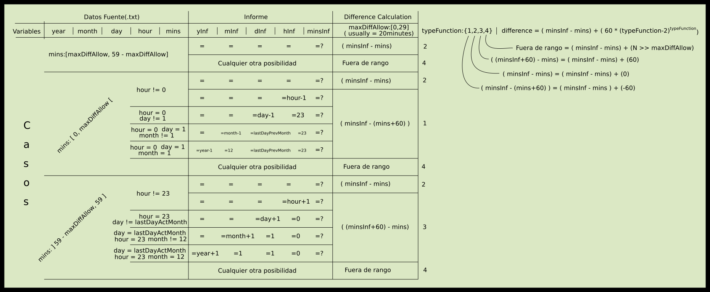
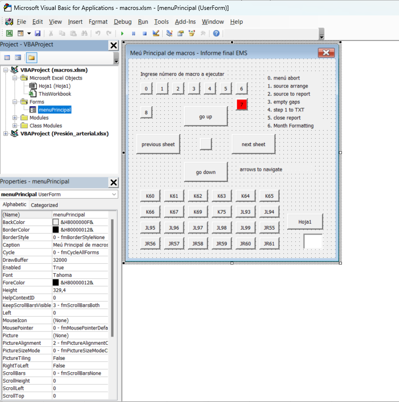

# El Diamante – Oil Control (VBA)

This project was developed around **August 2019**, during my remote work at **Transportes El Diamante** from Constitución, Chile; with the goal of **automating the verification of diesel fuel usage** between the loading records from **COPEC** and the information provided by the **OnlineAVL** system (GPS Chile).

---

## 🧠 Context

During that month, I learned **Visual Basic for Applications (VBA)** and built this system inside an Excel workbook (`macros.xlsm`) to automate most of the comparison workflow between both data sources.

Main project flow:
1. Download and clean raw data from the COPEC website.  
2. Retrieve fuel consumption records from the OnlineAVL system.  
3. Analyze, cross-check, and report discrepancies between both datasets.  

The earliest stage of this project (prior to 2015) started with **AutoHotKey scripts**, which are published separately (soon):
👉 [`el-diamante-oil-control-ahk`](https://github.com/tuusuario/el-diamante-oil-control-ahk)

---

## 📊 Initial analysis

Part of the logical design for the difference calculation is shown below, created during the early analysis phase:



---

## ⚙️ Project structure

The main workbook (`macros.xlsm`) contains multiple VBA modules exported into the [`src/`](src/) folder, organized as follows:

```
src/
├─ Modules/
├─ Classes/
└─ Forms/
```

The main interface was built as a **VBA UserForm**, shown below:



Each button triggers a specific macro corresponding to one part of the workflow

---

## 💻 Code example

The following image shows the full stack of modules and a portion of the code of one of them:


---

## 📁 Main files

| File / Folder | Description |
|----------------|--------------|
| `macros.xlsm` | Excel workbook containing all VBA macros and the main UserForm. |
| `DatosInformes.accdb` | Access simple database with the quantity of trucks and their plates. |
| `src/` | Source code exported from the VBA editor. |
| `images/` | Project and development screenshots. |

---

## 🧩 Personal notes

This code was never intended for public sharing; it was an internal and personal tool.  
Since then, my coding practices have evolved substantially, focusing on **clean, structured, and maintainable code**.

I haven’t used this project for several years (since around 2022 when the company ended their activity), but I’m publishing it on GitHub to document an important stage in my learning process and to showcase part of my early automation work, ability to solve problems and quickly improvise even though I had no prior experience with VBA or its editor.

---

## 📜 License

This repository is published **for demonstration and educational purposes only**.
All code remains the property of its original author and **is not intended for commercial or production use**.
